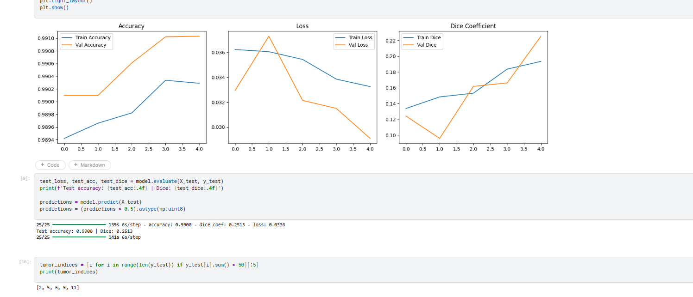
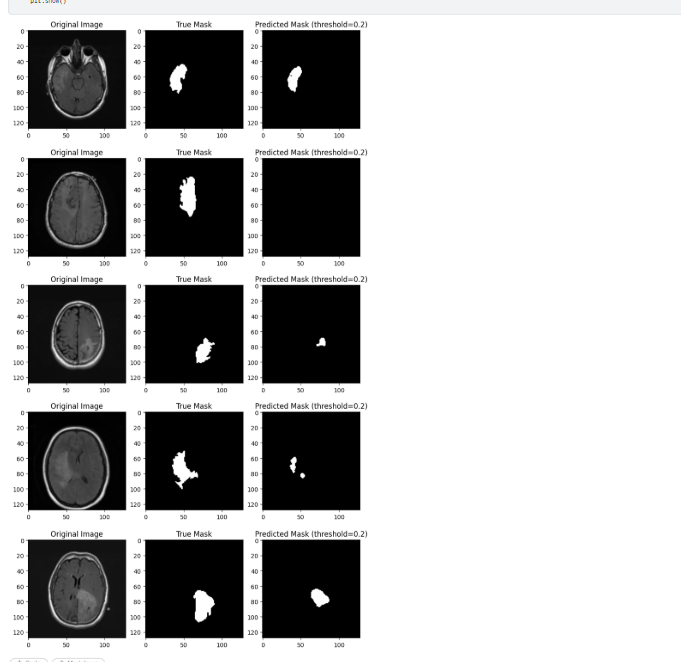
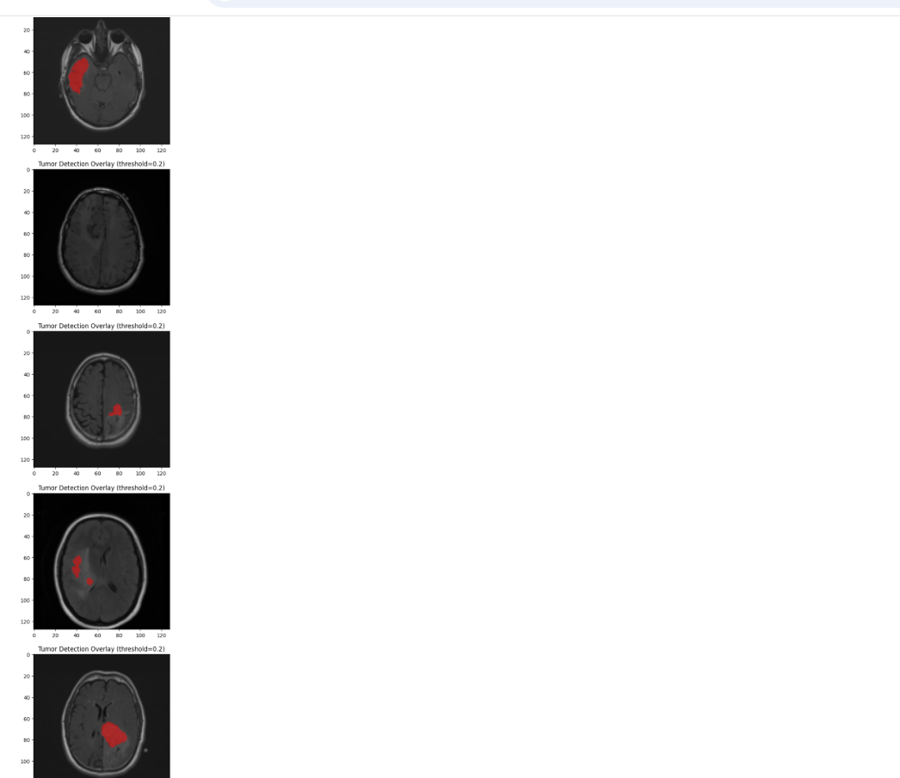

# Brain Tumor Segmentation — U-Net — LGG MRI

A deep learning model that looks at a brain MRI scan and outlines where a tumor is, pixel by pixel, using a U-Net convolutional neural network.

**Result:** Dice score of 0.2513 on scans the model had never seen before, after 5 training epochs on CPU.

> **Learning-project disclaimer:** This repository is for machine-learning education and experimentation. It is not a medical device and must not be used for diagnosis or clinical decision-making.

---

## What is image segmentation?

Most people know image *classification* — a model looks at a photo and says "this is a cat." Segmentation goes further: instead of labeling the whole image, it labels every single pixel.

For a brain MRI, the model doesn't just answer "is there a tumor?" — it answers "which exact pixels are the tumor?" The output is a mask: a black-and-white image where white marks tumor and black marks everything else.

## Repository contents

- `notebooks/brain_tumor_segmentation_unet.ipynb` — runnable reference implementation of the documented data preparation, U-Net training, evaluation, and visualisation workflow
- `training_curves.png`, `predicted_masks.png`, `tumor_overlay.png` — figures from the recorded run described below
- `requirements.txt` — Python dependencies

## The dataset

[LGG MRI Segmentation](https://www.kaggle.com/datasets/mateuszbuda/lgg-mri-segmentation) — brain MRI scans from 110 patients (sourced from The Cancer Imaging Archive / TCGA), each paired with a tumor mask hand-drawn and approved by a radiologist at Duke University.

The full set has 3,929 slices. All slices (tumor and non-tumor) were used for this run, split 80/20 into 3,143 training and 786 test images.

## How U-Net works

U-Net is named for its shape — it goes down, then back up, like the letter U.

- **Going down (the encoder):** the image is compressed step by step, learning *what* is in the image (edges, textures, tumor-like shapes).
- **Going up (the decoder):** the compressed understanding is expanded back to full size, so the model can say *where* the tumor is.
- **The shortcuts (skip connections):** fine detail lost on the way down is passed directly across to the way up — this is why U-Net can draw sharper outlines than a plain encoder-decoder, and why it's the standard choice for medical imaging.

## Setup

| Component | Choice |
|---|---|
| Model | U-Net |
| Input | 128×128 grayscale MRI slices |
| Output | Binary tumor mask |
| Loss | Binary Cross-Entropy |
| Optimizer | Adam |
| Training | 5 epochs, batch size 16, all 3,929 slices (tumor + non-tumor) |
| Environment | Kaggle Notebooks, CPU (~29 min/epoch) |
| Framework | TensorFlow / Keras |

## Results summary

| Metric | Score |
|---|---|
| Test Dice | 0.2513 |
| Test accuracy | 0.9900 (not meaningful on its own — see below) |
| Train Dice (final epoch) | 0.1935 |
| Validation Dice (final epoch) | 0.2254 |

## Why Dice, not accuracy

Accuracy is misleading here. Tumor pixels are a small minority of the image — a model that predicts "no tumor" everywhere would still score close to 99% accuracy while being clinically useless. Dice coefficient measures actual overlap between the predicted mask and the true mask, which is why it's reported as the primary metric.

## Training curves

The validation Dice curve was still rising when training stopped at epoch 5 (0.1243 → 0.2254), indicating the model had not yet converged. Training was limited to 5 of a planned 20 epochs due to CPU-only compute availability on this run.

## Predicted masks

At the default 0.5 probability threshold, most predicted masks came back empty due to the limited training. The classification threshold was lowered to 0.2 for these visualizations to better show what the model had actually learned — this is disclosed here rather than presented as the default result, and does not change the Dice/accuracy scores reported above, which were computed at the standard 0.5 threshold.

## Tumor detection overlay

The predicted tumor region (red) overlaid on the original MRI. 4 of 5 samples shown here have a correctly localized detection; one sample was missed by the model at this stage of training.

## How to run

1. Open `notebooks/brain_tumor_segmentation_unet.ipynb` on Kaggle Notebooks (or Google Colab)
2. Attach the [LGG MRI Segmentation](https://www.kaggle.com/datasets/mateuszbuda/lgg-mri-segmentation) dataset as an input
3. Run cells in order — the notebook builds and trains the U-Net, then evaluates and visualizes results
4. GPU is recommended (Settings → Accelerator) — training on CPU takes roughly 30 minutes per epoch

### Reproducibility note

The notebook is a clean, runnable implementation of the documented approach. The scores above are the recorded results of the original CPU run. A fresh run can vary with the train/test split, package versions, hardware, and random initialization; it should be treated as a reproducibility exercise rather than a clinical benchmark.

## Tech stack

Python · TensorFlow/Keras · OpenCV · NumPy · scikit-learn · Matplotlib

## Limitations

- Trained on all slices, but for only 5 of a planned 20 epochs, so both training and validation Dice were still improving when the run stopped
- Uses grayscale input; the original scans have additional MRI sequence channels that could carry extra useful information
- Trained on one dataset from one source, so it may not transfer well to scans from different machines or hospitals
- CPU-only training was the main practical constraint on this run — a GPU-enabled session would make longer training (and likely a substantially higher Dice score) practical

## References

- Ronneberger, O., Fischer, P., Brox, T. (2015). *U-Net: Convolutional Networks for Biomedical Image Segmentation.* MICCAI 2015.
- Buda, M., Saha, A., Mazurowski, M. A. (2019). *Association of genomic subtypes of lower-grade gliomas with shape features automatically extracted by a deep learning algorithm.* Computers in Biology and Medicine, 109, 218-225.
